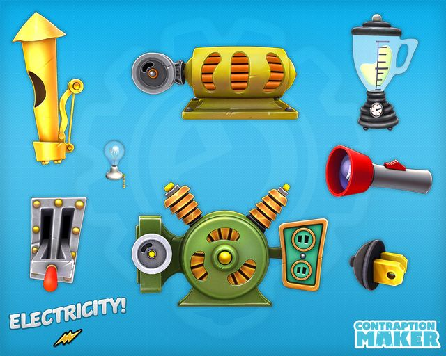

# 8. Art direction: Cartoon Industrial

## 8.1 The look in one paragraph

A bubbly, old-fashioned cartoon factory. Everything looks like real, working, slightly weathered industrial machinery (boilers, pipes, valves, gauges, pistons, flywheels, chimneys) but drawn as soft, inflated, friendly shapes, like balloon animals made of brass and copper. Nothing is sharp or scary. Every part visibly does something. And the machine is literally a jigsaw puzzle: parts have pegs, sockets and tabs that interlock and only fit where the grammar allows.

- **Keywords:** bubbly, pillowy, chunky, riveted, brass and copper, pipes with elbows, glass tubes with bubbles, pressure gauges, steam puffs, jigsaw tabs, old but cheerful, hand-painted flat shading.
- **Not:** glossy 3D, shiny chrome, sharp metal, grime, rust streaks, dark and grungy, busy textures, realistic factory.
- **Mood:** a toy workshop that a tinkering mouse (Gus) built. Warm, tactile, forgiving.
- **Hierarchy:** the word plate is always the clearest thing on any part; decoration stays quieter than the word and the grammar symbol.

> Secondary reference (Contraption Maker "Electricity" parts sheet supplied by the teacher): useful only for chunky readable silhouettes and obvious plugs, dials and switches. The Cartoon Industrial direction replaces its glossy 3D look with rounder, flatter, pipe-heavy 2D shapes. Do not copy its artwork.



## 8.2 Style guide

| Swatch | Token | Hex | Use |
|---|---|---|---|
|  | **oil** | #232B33 | Outlines (5 px at 1080p), darkest details |
|  | **iron** | #4A5865 | Housing bodies, bolts, stands |
|  | **brass** | #D4A33A | Main warm metal: housings, rims, lamps |
|  | **copper** | #C46A3B | Pipes, arches, whistles |
|  | **verdigris** | #4FA392 | Patina bodies, engine housings |
|  | **steam** | #F3F7F8 | Steam puffs, highlights |
|  | **floor teal** | #2E6F7A | Workbench background (mid-tone, calm) |
|  | **floor plate** | #3C8794 | Riveted floor plates and grid lines |
|  | **label paper** | #FFF6E3 | Word plates (fixed, always dark text on this) |
|  | **rust accent** | #B5502B | Rarely: tiny wear marks and warning stripes |

> Symbol colors from the teacher (noun #D2232D, verb #43AD73, adjective #4DB6E6, adverb #1A67AD, article #F08DB5, pronoun #E0C800, conjunction #9B7AB9, preposition #7A4318, interjection #F97316) are the dominant color block of each part and are never recolored. A night mode darkens the floor and keeps the same parts.

| Rule | Value |
|---|---|
| Shapes | Start from the symbol silhouette (triangle, circle, crescent, double arrow, drop) and inflate it: corner radius at least 28% of the shortest side, edges bulge outward 6 to 10% like a pillow. |
| Outline | 5 px oil, rounded joins and caps, same weight on every part. |
| Shading | Flat base color, one 12% darker bottom band, one soft highlight blob at 25% opacity top-left. No sharp specular glare, no chrome gradients. |
| Rivets and bolts | 3 to 4 per part, 4 px radius, small inner highlight dot; placed on seams and corners. |
| Wear | At most 3 tiny scuffs per part at 12% opacity (old but cheerful). Off in Calm Flat. |
| Pipes | 22 px thick, 5 px outline, brass or copper fill, light stripe at 25%; straight, elbow, tee and arch pieces; glass sections show rising bubbles when running. |
| Squash and stretch | On snap: 120 ms scale 1.08 wide by 0.92 tall, then settle. On drop: soft jelly wobble 200 ms. Off in calm mode. |
| Touch targets | At least 64 px for any draggable part, even when it looks small. |

## 8.3 Housing look (each one a different shape and color)

| Housing | Body (bubbly) | Color family | Signature details |
|---|---|---|---|
| WHO | Squat round boiler tank with a tall chimney | Brass yellow with a red-triangle peg ring | Wide hatch that swells as parts are added |
| WHAT THEY DID | Engine block with piston and flywheel | Verdigris green-teal | Piston visible through a porthole |
| WHAT IT HAPPENED TO | Receiving tank with a funnel top | Warm red-orange | Funnel mouth that opens wide |
| HOW THEY DID IT | Control cabinet with a row of dials | Blue | Gauge row and a speed knob |
| WHERE | Arched pipe bridge and junction box | Copper brown | Arch pipe curves overhead |
| SHOUT | Whistle tower | Orange | Drop-shaped steam whistle on top |
| JOIN | Big union clamp | Purple | Chunky clamp bolts |
| START lever | Floor-mounted lever with a pressure gauge | Red | Gauge climbs while the machine runs |
| Pixel Cinema | Small riveted pixel cinema with a marquee, a round chimney and a pair of red curtains behind the window, with a projector tank on top | Iron and brass | The projector tank fills as the pipes deliver pressure |

## 8.4 Jigsaw connection language (how the machine puzzles itself together)

- **Component pegs and housing sockets use the symbol shapes.** A noun fits a large triangle hole, an article a small triangle, an adjective a medium triangle, a pronoun an inverted triangle, a verb a circle, an adverb a small circle, a preposition a crescent, a conjunction a double-arrow slot, an interjection a drop. A wrong part never goes in: its peg does not match the hole. This is shape matching in the Montessori spirit.
- **Housings interlock with each other.** Each housing has a bubbly flange tab on its right edge and a blank on its left. Tab and blank shapes differ by housing so only legal neighbors interlock; the rule comes from `legalNext()`, the shapes make it visible.
- **Assembly feedback:** a soft rubbery thunk, a small hiss of steam at the seam, a squash-and-settle, and bolts that light briefly. The seam stays visible as a ring of rivets.
- **Pipes bridge the gaps** between housings (and to the screen) with elbow and arch pieces drawn automatically; the student never has to connect cables by hand.
- **When parts are removed** the housing deflates with a little sigh and the neighbors slide together.

## 8.5 Flow, effects and idle behavior

- **Ink pressure:** a train of colored bubbles runs through the pipes, taking on each part's symbol color as it passes. It ends in the cinema's projector tank, which fills like a lamp warming up; then the curtains open.
- **Gauges and glass:** every housing has a gauge or glass tube that reacts (needle swings, bubbles rise). These are the visible effects of grammar being correct.
- **Steam leak (not an error):** at the first problem, a puff of steam leaks from the open pipe end with a quiet "pssh", the needle sinks and the missing socket pulses.
- **Idle:** parts are still unless the student acts. Tapping a part plays its tiny toy animation (piston pumps, valve pops). A teacher setting can add a very slow idle breathing wobble; off by default.
- **Silly flourishes:** extra deterministic gags scale with the silly score (a rubber duck pops from a tank, a boxing glove from a pipe). Calm mode turns them off.

## 8.6 Sensory and motion rules

- No flashing faster than 3 times per second and no large-area flashes. Steam and bubbles are soft and slow.
- Nothing moves by itself except in response to the student (START lever, tapping a part, dragging). Idle is still.
- Calm mode: no steam, no bubbles, no squash and stretch, no flourishes, curtains open in three steps instead of sliding; parts simply highlight in order and the screen crossfades. The OS reduced-motion setting turns it on by default.
- Sound: soft rubbery thunks, small brass dings, gentle bubble sounds; low volume by default; effects and voice have separate sliders; one-tap mute. No loud clangs or sirens. The steam-leak sound is a quiet "pssh".
- Layout is predictable: START lever, Pixel Cinema and Parts Bin always sit in the same places; background pipes are very low contrast and never sit behind words.

## 8.7 Skins, colorways and variants

| Skin or colorway | What changes |
|---|---|
| Cartoon Industrial: Brass Works (default) | Brass, verdigris and copper bodies on a teal floor, as in section 8.2 |
| Cartoon Industrial: Copper and Teal | Copper-forward bodies, teal pipes |
| Cartoon Industrial: Candy Factory | Pastel enamel bodies with white pipes; same shapes and rules |
| Cartoon Industrial: Night Shift | Dark navy floor and warm lamp light for a dark-mode preference |
| Calm Flat | Same shapes with flat fills only: no highlight blobs, no wear, no bubbles or steam, thinner details; for students who find the default busy |
| Part variants | At least 3 cosmetic variants per part (for example a Noun Boiler can be a barrel, a pot-belly or a tall tank) and 2 bodies per housing; unlocked with cheese gears or by the teacher |

> A skin or variant changes appearance only. It never changes the sentence, the video script or what the machine accepts. The old "Old Metal" idea from v4 is merged into the default look.

## 8.8 How to build the art (parametric, not hand-drawn per combination)

- **Bubbly shape generator:** a TypeScript function `inflate(shape, {radius, puff, seed})` turns each symbol silhouette into a rounded pillow path. Parts, housings, pegs and sockets are all generated from the same silhouettes so they always match.
- **Layer stack for every part:** shadow, base body, bottom shade, highlight blob, rivets, seam lines, detail layer (porthole, gauge, piston, handle), word plate, symbol badge, outline. Colorways are token swaps.
- **Pipe renderer:** a path along housing ports with round caps; glass sections with animated bubble circles.
- **Variants and details** are small config objects (which porthole, which handle, which chimney), not new drawings.
- **Hand-made art needed:** mostly the pixel rigs (section 6) and a few hero illustrations (Gus, the Pixel Cinema bezel, the START lever). Everything else is generated, so the art cost stays low.
- Fonts: Lexend for plates and captions; no decorative fonts on parts.

| Art item | Count (first release) |
|---|---|
| Component generators (one per part of speech) with 3 variants | 10 x 3 |
| Housing bodies | 7 x 2 |
| Pipe kinds | 4 (straight, elbow, tee, arch) |
| Gadgets (dice valve, clamp, pin, magnifier, picture lens) | 5 |
| Controls (START lever, tense crank, silly gauge, horn, tape, journal slot) | 6 |
| Hero illustrations (Gus, screen bezel, workbench background) | 3 |
| Decor (chimneys, gauges, lamps, flags, name plate) | about 12 |
| Colorways | 4 plus Calm Flat |

## 8.9 Tech stack for the contraption

| Need | Recommendation |
|---|---|
| App | Vite + React + TypeScript; Zustand for state; Vitest and React Testing Library; Playwright for visual smoke tests |
| Drag and drop | dnd-kit with pointer, touch and keyboard sensors plus the tap-to-place path |
| Contraption parts | Parametric SVG components for parts, housings and pipes; GSAP (or Motion) timelines for part animations and the bubble flow |
| Pixel Cinema | Canvas 2D low-resolution renderer (160 x 90 internal pixels) reading the scene script; pixel primitives with no anti-aliasing; integer upscale with image-rendering: pixelated; rigs as data (procedural pixel rigs, with hand-drawn hero sprites where needed) |
| Audio | Web Audio for sound effects and bubble sounds; Web Speech API for narration |
| Storage | Dexie (IndexedDB) for entries, scripts, posters, videos; localStorage for small settings |
| Export | canvas.captureStream + MediaRecorder; jsPDF or pdf-lib for the storybook PDF |
| Performance | Steady 30 fps on a mid-range iPad or Chromebook; cache generated part SVGs; load rigs and clips lazily per pack; script generation under 50 ms |

## 8.10 Project structure additions

```
src/
  engine/semantic.ts        SemanticFrame builder from analyzed tokens
  director/director.ts      frames + cast -> SceneScript   (pure, seeded)
  director/cast.ts          a / the / pronoun resolution, ambiguity hints
  director/data/            verbs.json adverbs.json adjectives.json preps.json nouns.json packs/
  render/stage.ts           Canvas 2D player for scripts (pixel primitives, curtains, dissolve)
  render/rigs/              biped.ts quadruped.ts bird.ts critter.ts serpent.ts vehicle.ts object.ts
  render/clips/             run.ts jump.ts eat.ts ... (data-driven where possible)
  render/export.ts          MediaRecorder export
  art/inflate.ts            bubbly shape generator
  art/parts/                nounBoiler.tsx verbEngine.tsx adverbGauge.tsx ... (one per part of speech)
  art/housings/             who.tsx did.tsx how.tsx where.tsx happenedTo.tsx shout.tsx join.tsx
  art/pipes.tsx  art/themes.ts (colorways and Calm Flat)  art/sounds.ts
  contraption/              Workbench.tsx Housing.tsx Component.tsx Pipe.tsx StartLever.tsx RunSequence.ts
                            PartsBin.tsx FilmStrip.tsx CastPanel.tsx GusOrders.tsx
  state/contraption.ts      SentenceMachine and Story state, versions
```
