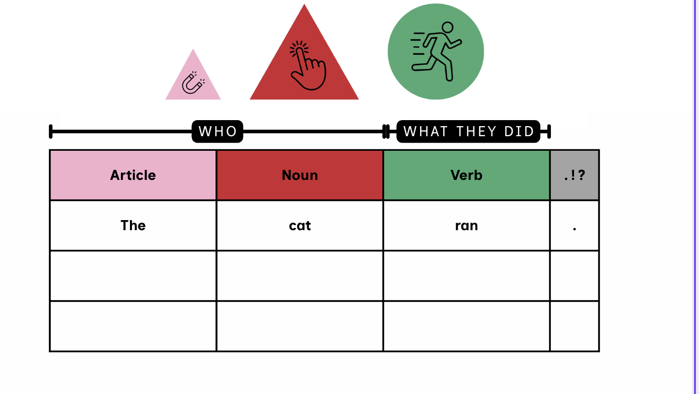
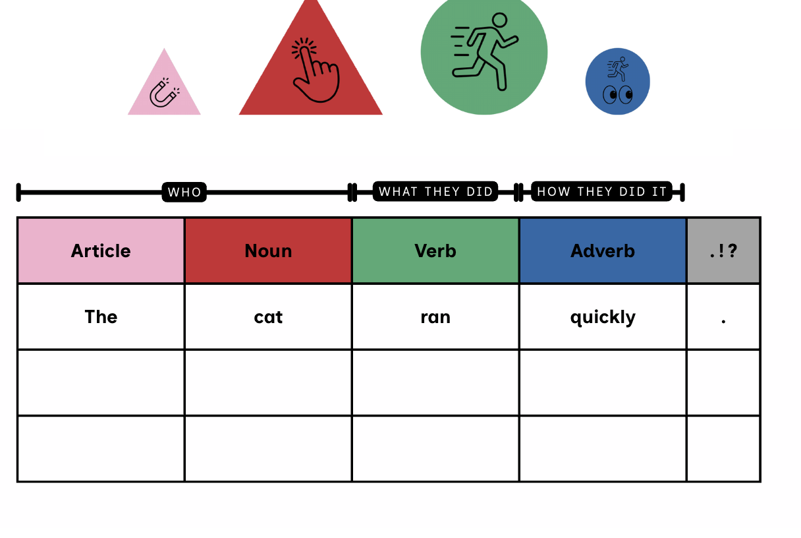

# 18. Puzzle-Piece Machine Builder (drag and drop, old-metal style)

> **v5 note:** the drag-and-drop, snapping, tap/keyboard and bracket rules below still apply, but the visual style (old metal puzzle pieces) is superseded by the contraption parts and housings in sections 4 and 8. The old-metal look is folded into the default Cartoon Industrial skin (section 8). Bracket plates are now the labels painted on the housings (WHO, WHAT THEY DID, HOW THEY DID IT).

The machine itself is something the students build and decorate. It is a row of metal puzzle-piece modules (one per part of speech) with bracket plates over them, exactly like the teacher's Sentence Chart worksheet, and a paper-tape printout of finished sentences underneath. Students drag pieces out of a Parts Bin, snap them together, style them, and then spin or build sentences with the machine they made. This section is the visual and interaction core of the whole game; the sections before it describe the engine and modes it drives.

## 18.1 Teacher reference: the Sentence Chart (build the main screen from this)





> Save both screenshots in the repo as `docs/reference/sentence-chart-1.png` and `sentence-chart-2.png` and treat them as the visual spec for the chart layout. What the screenshots establish:

- **Symbols float above their columns** on a shared baseline and are drawn at different sizes: the noun triangle is largest, the verb circle is nearly as wide, the article triangle is about half the noun, and the adverb circle is about half the verb. Use ratios noun 1.00, verb 0.88, article 0.50, adverb 0.45 (measured from the screenshots). Other symbols are not shown, so use these placeholders and confirm with the teacher: adjective 0.70, pronoun 0.70, preposition 0.70, conjunction 0.80 (wide), interjection 0.60.
- **A bracket bar sits between the symbols and the table.** Each bracket is a thick black line with end caps and a black rounded label with white spaced letters: WHO, WHAT THEY DID, HOW THEY DID IT. Neighboring brackets are separated by a small double tick. A bracket spans exactly the columns it covers (WHO covers Article and Noun).
- **A table of colored header plates** (Article pink, Noun red, Verb green, Adverb blue) names each column. The header colors are the symbol colors and never change.
- **A grey punctuation column ".!?"** ends every row.
- **Several blank rows:** each row holds one sentence. Row 1 is where the machine lands its result; earlier sentences stay in the rows below like a paper tape. The teacher's worksheet shows three rows; make the visible row count a setting (3 default).

## 18.2 Concept and look

- **Puzzle-piece machine:** each reel module is a chunky metal casing with jigsaw knobs and sockets on its sides, a colored header plate with the part-of-speech name, a window for the word, and a floating symbol above it. Pieces click together like a physical puzzle.
- **Old metal, friendly not scary:** riveted iron, brass, copper and green-patina (verdigris) casings, plus a few enamel colors. All finishes are matte. No glare, no flicker, nothing that moves unless the student does something.
- **Different shapes:** casings come in several silhouettes (block, gear-edged, hexagon, arch-top, scalloped, cloud, arrow, barrel, tower). Shape is purely visual; the word window size and touch targets stay the same.
- **The word always sits on a cream paper plate** inside the piece, in dark Lexend text, so legibility never depends on the finish the student picks. The teacher's symbol color header strip is never recolored.

## 18.3 Parts Bin (catalog)

| Category | Pieces | Notes |
|---|---|---|
| Reel modules | Article, Adjective, Noun, Pronoun, Verb, Adverb, Preposition, Conjunction, Interjection | One per part of speech; each carries the teacher's symbol above it at the chart scale. Unlimited copies. |
| Punctuation module | .!? plate | Always the last piece. Shows "." or "!"; the student can tap to switch when both are legal. "?" is not offered in v1 (see section 34). |
| Bracket plates | WHO, WHAT THEY DID, HOW THEY DID IT, WHERE, WHAT KIND, WHAT IT HAPPENED TO, JOIN, SHOUT | Auto-placed by the engine by default; draggable in Label It mode (10.7). Label wording is the teacher's style; confirm the extra labels. |
| Control modules | Lever, Tense crank (time dial), Silly gauge (silly dial), Speaker horn, Paper tape (history rows), Journal slot | Functional gadgets that dock to the chassis. Lever and speaker are free; others unlock or are teacher-unlocked. |
| Reel gadgets | Dice cap, Padlock arm, Pushpin (pin drum), Magnifier (hear the word), Picture lens (noun picture) | Dock onto a single reel module. These are the same lock and dice functions as in section 19.3, now physical parts. |
| Decor | Rivets, pipes between modules, gears that turn when spinning, pressure gauges, lamps, flags, chimney with steam, name plate | Cosmetic. Motion off in calm mode. |
| Finishes and casings | Iron, steel, brass, copper, verdigris, six enamels; casing shapes above | Dragged from the Style Station onto a piece. |

## 18.4 Drag and drop rules

- **Chassis and start:** the machine always starts with a Starter Chassis holding at least a subject and a verb piece plus the punctuation plate. The student can start from an empty chassis, from a Gus template (the 33 patterns shown as symbol strips), or from a saved Blueprint.
- **Pieces snap by the grammar, not by guesswork:** when a piece is picked up, glowing drop zones appear only at positions that `legalNext()` (section 17.4) says are legal. Illegal positions show nothing. This replaces the "+" palette as the main interaction; the Workshop and Builder are the same Rail underneath.
- **Physical fit as feedback:** every piece has a jigsaw knob on its right edge and a socket on its left. Where a piece is legal, its knob visibly fits the neighbor; a piece dropped where it does not belong bounces back with a soft clank and a wobble. No error text, no red marks.
- **Generous targets:** snap radius at least 48 px; pieces at least 88 px wide and 112 px tall including the symbol; a magnetic pull animation (off in calm mode) draws a nearby piece into its zone.
- **Moving and removing:** drag to reorder within legal positions; drag a piece to the recycle chute (or tap its x) to remove it. Removal that would leave the machine without a subject or verb is blocked with a gentle bounce.
- **Tap alternative (required):** tap a piece in the Parts Bin to pick it up (it follows as a highlighted "held" piece), then tap a glowing zone. The same works with the keyboard (arrow keys to choose a zone, Enter to place, Esc to put back) and with a switch/assistive device. Use dnd-kit with pointer, touch and keyboard sensors; set touch-action none only on drag handles so the page still scrolls.
- **Undo and redo** are large buttons; the layout autosaves.
- **Length:** 2 to 12 reel modules; the Spin machine's reel count is just the number of reel modules in the chassis.

## 18.5 Style Station (finishes, shapes, gadgets)

- **Paint and re-case:** drag a finish swatch onto any piece to repaint it, or a casing shape onto a piece to change its silhouette. A paint bucket paints all pieces; a dice button randomizes the whole look.
- **Gadgets** are dragged onto a piece or the chassis (table in 10.3). Functional gadgets call the same engine functions as the lock and dice buttons, so a machine with no gadgets still works with simple tap controls.
- **Unlocks:** a free starter set (iron and brass finishes, block and hexagon casings, lever, speaker horn). Everything else costs cheese gears at a visible price, or the teacher unlocks all. No random loot boxes and no timers.
- **Accessibility guard:** a finish or casing combination is only offered if the cream word plate keeps at least 7:1 contrast; run an automated check over every combination in the test suite.

## 18.6 Visual style guide

| Token | Value | Use |
|---|---|---|
| iron | #3A4651 | dark casing, outlines (3 px) |
| steel | #8A97A3 | neutral casing |
| brass | #B68D40 | casing, knobs, name plate |
| copper | #B4693F | casing, pipes |
| verdigris | #4F9C8B | patina casing |
| paper | #FFF6E3 | word plates (fixed) |
| symbol colors | as supplied by the teacher (noun #D2232D, verb #43AD73, adjective #4DB6E6, adverb #1A67AD, article #F08DB5, pronoun #E0C800, conjunction #9B7AB9, preposition #7A4318, interjection #F97316) | header plates, never changed |

- Render pieces as **parametric SVG React components** (casing path variant x finish fill x decor layers) rather than raster images, so every combination works without hundreds of assets. Matte texture: a very low-opacity SVG noise filter and a few rivet circles. Short hard shadows (3 px offset) match the rest of the game.
- Sounds: a soft metallic thunk when pieces snap, a brass ping when a sentence lands. Volume capped low; mute and calm mode one tap away.
- Avoid: glossy reflections, flashing lamps, busy textures behind words, steam or gear motion in calm mode, any element that animates by itself.

## 18.7 Brackets and Label It!

**Auto brackets (default).** The engine computes bracket plates from the sentence so the machine always shows the structure like the teacher's chart. Default label mapping (teacher to confirm wording for the rows marked new):

| Covers | Label | Tier / status |
|---|---|---|
| Subject: article, adjectives, noun, or pronoun (including "and" noun phrases) | WHO | 1, from worksheet |
| Verb or verbs joined by and/or | WHAT THEY DID | 1, from worksheet |
| Adverb or adverbs (including an opening adverb) | HOW THEY DID IT | 1, from worksheet |
| Preposition and its noun phrase | WHERE | 1, new |
| Object noun phrase after a verb (pattern 31) | WHAT IT HAPPENED TO | 1, new |
| Interjection | SHOUT | 1, new |
| Conjunction joining two clauses | JOIN | 1, new |
| Adjectives inside WHO | WHAT KIND | 2 (optional second row of small brackets) |

> Two-clause sentences (patterns 16 and 19) get one set of brackets per clause. Fixtures: write the expected bracket spans for all 33 patterns as test data once the teacher confirms the labels.

**Label It! (mini-mode from the worksheet).** Given a sentence (from a spin, the Workshop or the Journal), the bracket plates sit in a tray. The student drags each plate onto the pieces it covers. A correct drop locks in with a click and a gear. A wrong drop wobbles back and Gus gives a hint ("WHO is the one doing it. Which pieces tell WHO?"); after two tries Gus slides the plate into place. No score loss. **Symbol Match** is the sibling mode: the floating symbols above the columns are hidden and the student drags each symbol up to its column.

## 18.8 Chart screen wireframe

```
    (art)   (   NOUN   )  (  VERB  )  (adv)            <- floating symbols, chart scale
  |---- WHO ----|  |-- WHAT THEY DID --|-- HOW THEY DID IT --|   <- bracket plates (auto)
  +---------+----------+----------+----------+----+
  | Article | Noun     | Verb     | Adverb   |.!? |   <- metal puzzle-piece headers
  +---------+----------+----------+----------+----+
  |  The    |  cat     |  ran     |  quickly |  . |   <- row 1: the reels land here
  |  A      |  bird    |  sang    |  softly  |  . |   <- paper tape (earlier sentences)
  |         |          |          |          |    |
  +---------+----------+----------+----------+----+
  [Lever] [Tense crank] [Silly gauge] [Horn] [Journal slot]   [Parts Bin] [Style]
```

> Behavior: when the lever is pulled the reels in row 1 spin and land; the previous row-1 sentence is pushed down the paper tape. Tapping any tape row reads it aloud; a star sends it to the Journal; dragging a row onto the Journal slot saves it. The bracket plates always describe row 1 (the current sentence); history rows are plain.

## 18.9 Data model

```
type Casing = 'block'|'gear'|'hex'|'arch'|'scallop'|'cloud'|'arrow'|'barrel'|'tower';
type Finish = 'iron'|'steel'|'brass'|'copper'|'verdigris'|'enamelCream'|'enamelSky'
            | 'enamelMint'|'enamelCoral'|'enamelPlum'|'enamelMustard';
interface PieceStyle   { casing: Casing; finish: Finish; decor: string[]; }
type GadgetId = 'dice'|'padlock'|'pushpin'|'magnifier'|'pictureLens';

interface ReelPiece    { id: string; kind: 'reel'; pos: Pos; style: PieceStyle; gadgets: GadgetId[]; }
interface PunctPiece   { id: string; kind: 'punct'; allowed: ('.'|'!')[]; style: PieceStyle; }
type BracketRole = 'who'|'did'|'how'|'where'|'kind'|'happenedTo'|'join'|'shout';
interface BracketPlate { id: string; role: BracketRole; label: string; span: [number, number];
                         mode: 'auto'|'manual'; tier: 1|2; clause: number; }
interface ControlPiece { id: string; kind: 'lever'|'tenseCrank'|'sillyGauge'|'horn'|'tape'|'journalSlot';
                         style: PieceStyle; }
interface MachineLayout { chassis: (ReelPiece|PunctPiece)[]; brackets: BracketPlate[];
                          controls: ControlPiece[]; decor: { id: string; x: number; y: number }[];
                          tapeRows: number; }
// MachineConfig (section 19.6) gains:  layout: MachineLayout   (reels[] is derived from layout.chassis)
// Pipeline: layout -> Rail (sockets) -> engine.spin / validate -> sentence -> brackets (auto) -> render
```

## 18.10 Tests for the Builder

- Dragging any piece only creates drop zones at positions where `legalNext()` allows it; for every position and piece type, the zone set equals the engine's answer.
- The tap and keyboard paths produce identical layouts to dragging for the same actions.
- Any layout reachable through the UI converts to a Rail that spins and validates (property test over random layouts and random styles).
- Style changes (finish, casing, decor, gadgets) never change the generated sentence for the same seed.
- Contrast test: every finish x casing combination keeps the paper plate and word text at 7:1 or better.
- Auto brackets match the fixtures for all 33 patterns and for random legal sentences; bracket spans never overlap incorrectly.
- Label It! accepts only the correct span, wobbles on wrong drops, and reveals after two tries.
- Layout autosaves and round-trips through a Blueprint exactly; touch targets measure at least 56 px; no horizontal page scroll at 9 and 12 modules.
